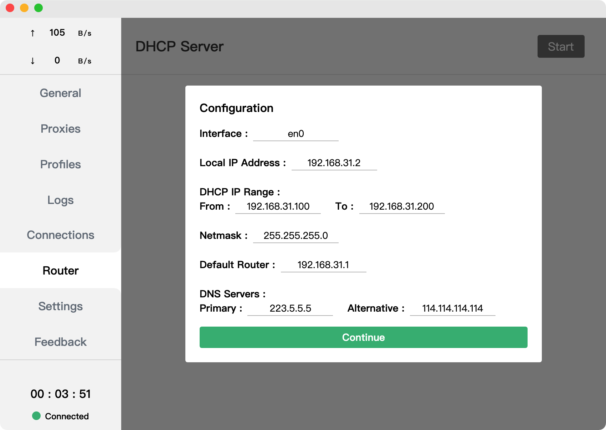
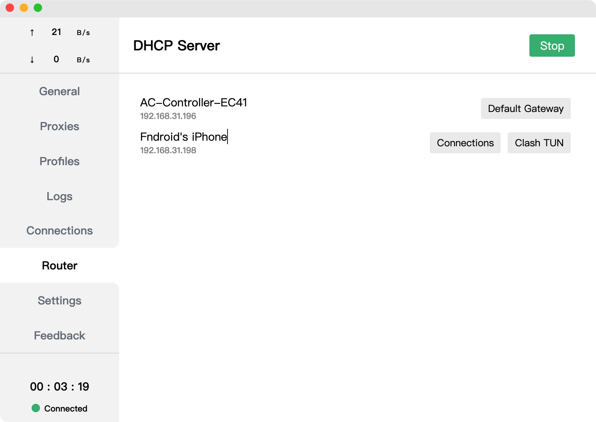

#DHCP服务器端

## 版本要求

0.16.0版本更新后，macOS版本支持DHCP服务端部署

## 用途

[Tun模式](./tun)下，macOS可作为局域网代理网关.DHCP服务器可以方便对局域网内其他设备进行地址及网关分配，进而控制设备流量是否被Clash接受并处理。

## 开启条件

1. [Tun模式](./tun)正确配置并运行，并且已经开启IP转发
1.网络中DHCP功能关闭(一般是路由器，避免冲突)
1.本机IP地址设置为静态地址

## 操作步骤

1.进入设置界面，底部找到`实验特征` 打开 `DHCP服务器` 选项
1.进入路由器界面，点击右上角Start按钮
   
点击接口右边选择对应网卡，此时剩下值会自动填充，如果不明白这些字段的意义，使用默认即可

1.点击继续后，DHCP服务器将会启动
   
局域网中设备重新连接后，列表中将会出现。 此时可以在`默认网关` 和 `碰撞调谐`中切换进而控制设备是否由Clash接管网络，切换后设备需要重新接入网络

**小费
接管切换后需要将设备重新接入网络方能获取正确的地址
:::

::: tip
启动 DHCP 服务端功能后，CFW 将会阻止系统进入休眠（但允许关闭显示器）
:::
